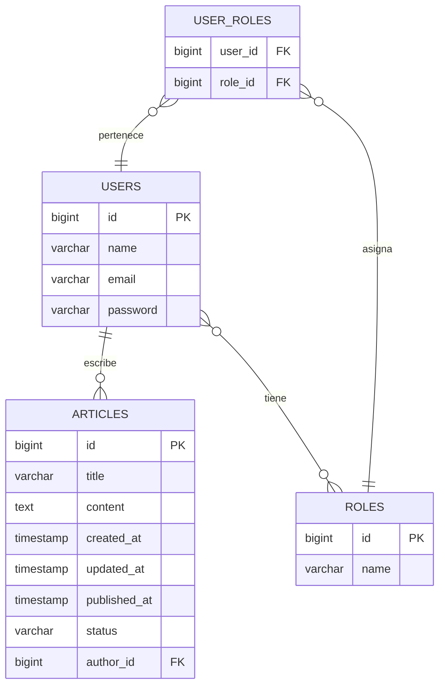
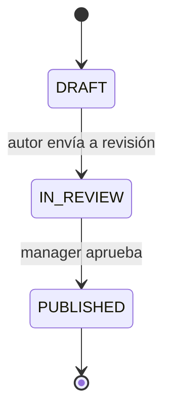

# 🌐 Mundo Tech — Periódico Digital API

API REST para el periódico digital **Mundo Tech**, donde autores crean artículos y managers los revisan y publican.

## 📋 Briefing

Proyecto backend desarrollado con **Spring Boot 3** que implementa un sistema de gestión de artículos periodísticos con control de roles (author/manager), flujo de revisión y estados de publicación.

## 🛠️ Tecnologías

| Tecnología | Versión |
|---|---|
| Java | 21 |
| Spring Boot | 3.5.16 |
| PostgreSQL | — |
| Maven | 3.9.16 |
| Lombok | — |

## 🗄️ Modelo de Base de Datos



### Relaciones

- **Article → User**: Many-to-One (un autor tiene muchos artículos, un artículo pertenece a un solo autor)
- **User → Role**: Many-to-Many (un usuario puede tener varios roles, un rol puede pertenecer a varios usuarios)

## 📡 Endpoints de la API

### Roles `/api/roles`

| Método | Ruta | Descripción | Código |
|---|---|---|---|
| `POST` | `/api/roles` | Crear rol | `201` |
| `GET` | `/api/roles` | Listar roles | `200` |
| `GET` | `/api/roles/{id}` | Obtener rol | `200` |

### Usuarios `/api/users`

| Método | Ruta | Descripción | Código |
|---|---|---|---|
| `POST` | `/api/users` | Crear usuario | `201` |
| `GET` | `/api/users` | Listar usuarios | `200` |
| `GET` | `/api/users/{id}` | Obtener usuario | `200` |
| `DELETE` | `/api/users/{id}` | Eliminar usuario (cascada artículos) | `204` |
| `POST` | `/api/users/{userId}/roles/{roleId}` | Asignar rol a usuario | `200` |

### Artículos `/api/articles`

| Método | Ruta | Descripción | Código |
|---|---|---|---|
| `POST` | `/api/articles?authorId=X` | Crear artículo (DRAFT) | `201` |
| `GET` | `/api/articles` | Listar todos | `200` |
| `GET` | `/api/articles/{id}` | Obtener por ID | `200` |
| `GET` | `/api/articles/author/{authorId}` | Buscar por autor | `200` |
| `PUT` | `/api/articles/{id}?authorId=X` | Actualizar contenido (solo autor) | `200` |
| `DELETE` | `/api/articles/{id}?authorId=X` | Eliminar (solo autor) | `204` |
| `PUT` | `/api/articles/{id}/send-review?authorId=X` | Enviar a revisión → IN_REVIEW | `200` |
| `PUT` | `/api/articles/{id}/approve?managerId=X` | Aprobar → PUBLISHED (solo manager) | `200` |
| `GET` | `/api/articles/status/draft` | Listar DRAFT | `200` |
| `GET` | `/api/articles/status/in-review` | Listar IN_REVIEW | `200` |
| `GET` | `/api/articles/status/published` | Listar PUBLISHED | `200` |

## 🔄 Flujo de Estados



## 🧪 Pruebas con Postman

### Setup inicial

1. Crear la base de datos en PostgreSQL:
   ```sql
   CREATE DATABASE mundotech;
   ```

2. Configurar credenciales en `application.properties` si es necesario

3. Ejecutar la aplicación:
   ```bash
   ./mvnw spring-boot:run
   ```

### Orden de pruebas recomendado

1. **Crear roles** → `POST /api/roles` con `{"name": "author"}` y luego con `{"name": "manager"}`
2. **Crear usuarios** → `POST /api/users`
3. **Asignar roles** → `POST /api/users/{userId}/roles/{roleId}`
4. **Crear artículos** → `POST /api/articles?authorId=X`
5. **Probar flujo completo** → crear → enviar a revisión → aprobar

## ⚙️ Cómo instalar y ejecutar el proyecto

### Requisitos previos

- Java 21
- Maven 3.9.16
- PostgreSQL

### Pasos

1. Clonar el repositorio:
   ```bash
   git clone <url-del-repositorio>
   cd mundotech
   ```

2. Crear la base de datos en PostgreSQL:
   ```sql
   CREATE DATABASE mundotech;
   ```

3. Configurar las credenciales de conexión en `src/main/resources/application.properties`:
   ```properties
   spring.datasource.url=jdbc:postgresql://localhost:5432/mundotech
   spring.datasource.username=tu_usuario
   spring.datasource.password=tu_contraseña
   ```

4. Ejecutar la aplicación:
   ```bash
   ./mvnw spring-boot:run
   ```

5. La API estará disponible en `http://localhost:8080`

## 📁 Estructura del Proyecto

```
src/main/java/com/femcoders/mundotech/
├── MundotechApplication.java
├── entity/
│   ├── Article.java
│   ├── ArticleStatus.java
│   ├── Role.java
│   └── User.java
├── repository/
│   ├── ArticleRepository.java
│   ├── RoleRepository.java
│   └── UserRepository.java
├── service/
│   ├── ArticleService.java
│   ├── ArticleServiceImpl.java
│   ├── RoleService.java
│   ├── RoleServiceImpl.java
│   ├── UserService.java
│   └── UserServiceImpl.java
└── controller/
    ├── ArticleController.java
    ├── RoleController.java
    └── UserController.java
```

## 👥 Equipo de desarrollo

| Nombre | Rol |
|---|---|
| Elena Almanza | Product Owner |
| Siuzanna Vachaganian | Scrum Master |
| Aïda García | Developer |
| Fabiana Leonardo | Developer |