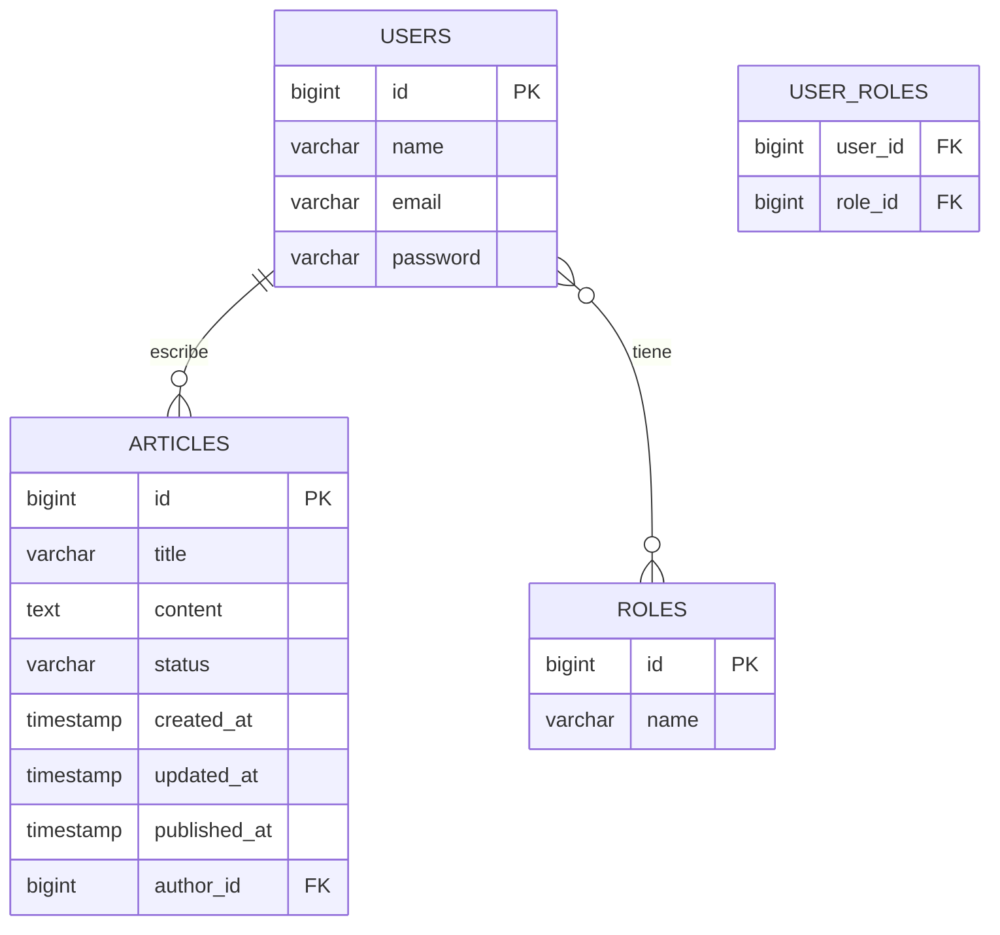
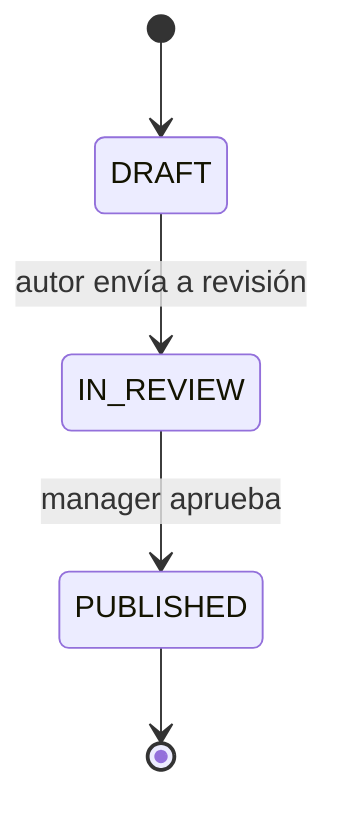

# 🌐 Mundo Tech — Periódico Digital

API REST + Frontend React para el periódico digital **Mundo Tech**, donde autores crean artículos y managers los revisan y publican.

---

## 📋 Briefing

Proyecto fullstack que simula un periódico digital. El backend (Spring Boot 3) expone una API REST con CRUD de artículos, usuarios y roles, mientras que el frontend (React + Vite) consume la API y proporciona una interfaz de usuario con diseño responsive.

---

## 🛠️ Tecnologías

### Backend

| Tecnología | Versión |
|---|---|
| Java | 25 |
| Spring Boot | 3.5.16 |
| PostgreSQL | — |
| Maven | 3.9.16 |
| Lombok | — |
| H2 (dev) | — |

### Frontend

| Tecnología | Versión |
|---|---|
| React | 19 |
| Vite | 8 |
| React Router | 7 |
| Axios | 1 |
| Sass | 1 |
| React Hook Form | 7 |
| React Icons | 5 |

---

## 📁 Estructura del proyecto

```
mundotech/
├── backend/                     ← Spring Boot API
│   ├── pom.xml
│   └── src/main/java/com/femcoders/mundotech/
│       ├── MundotechApplication.java
│       ├── config/
│       ├── controller/
│       ├── entity/
│       ├── repository/
│       └── service/
│
├── frontend/                    ← React + Vite SPA
│   ├── index.html
│   ├── package.json
│   ├── vite.config.js
│   └── src/
│       ├── main.jsx
│       ├── App.jsx
│       ├── config/
│       │   └── router.jsx
│       ├── styles/
│       │   ├── _variables.scss
│       │   ├── _reset.scss
│       │   ├── _globals.scss
│       │   └── main.scss
│       ├── components/
│       │   ├── Header/
│       │   ├── Footer/
│       │   ├── articlecard/
│       │   ├── articleList/
│       │   └── login-form/
│       ├── pages/
│       │   ├── home/
│       │   ├── login/
│       │   ├── articles/
│       │   ├── articleView/
│       │   ├── authorDashboard/
│       │   └── managerDashboard/
│       └── mockArticles.js
│
└── README.md
```

---

## 📡 Endpoints de la API

### Roles `/api/v1/roles`

| Método | Ruta | Descripción |
|---|---|---|
| `POST` | `/api/v1/roles` | Crear rol |

### Usuarios `/api/v1/users`

| Método | Ruta | Descripción |
|---|---|---|
| `GET` | `/api/v1/users` | Listar usuarios |
| `GET` | `/api/v1/users/{id}` | Obtener usuario |
| `POST` | `/api/v1/users` | Crear usuario |
| `DELETE` | `/api/v1/users/{id}` | Eliminar usuario |

### Artículos `/api/v1/articles`

| Método | Ruta | Descripción |
|---|---|---|
| `GET` | `/api/v1/articles` | Listar todos |
| `GET` | `/api/v1/articles/{id}` | Obtener por ID |
| `GET` | `/api/v1/articles/author/{authorId}` | Por autor |
| `GET` | `/api/v1/articles/status/draft` | Filtrar DRAFT |
| `GET` | `/api/v1/articles/status/in-review` | Filtrar IN_REVIEW |
| `GET` | `/api/v1/articles/status/published` | Filtrar PUBLISHED |
| `POST` | `/api/v1/articles` | Crear artículo |
| `PUT` | `/api/v1/articles/{id}` | Actualizar (solo autor) |
| `DELETE` | `/api/v1/articles/{id}` | Eliminar (solo autor) |
| `PUT` | `/api/v1/articles/{id}/send-review` | Enviar a revisión |
| `PUT` | `/api/v1/articles/{id}/approve` | Aprobar (solo manager) |

---

## 🗄️ Modelo de base de datos



---

## 🔄 Flujo de estados del artículo



---

## 🧪 Cómo ejecutar el proyecto

### Backend

```bash
cd backend
./mvnw spring-boot:run
```

> Requiere PostgreSQL con base de datos `mundotech` creada.

### Frontend

```bash
cd frontend
npm install
npm run dev
```

> El frontend arranca en `http://localhost:5173`.

---

## 🧩 Rutas del frontend

| Ruta | Página | Descripción |
|---|---|---|
| `/` | Home | Inicio con artículos |
| `/login` | Login | Selección de usuario |
| `/dashboard-author` | Author Dashboard | Panel del autor |
| `/dashboard-manager` | Manager Dashboard | Panel del manager |
| `/articles` | Articles | Listado de artículos |
| `/article-view/:id` | Article View | Vista detalle del artículo |

---

## ♿ Accesibilidad

El proyecto sigue principios de accesibilidad nivel AA:
- HTML semántico (`<header>`, `<main>`, `<footer>`, `<article>`, `<section>`)
- Atributos `aria-label` en elementos interactivos
- Contraste suficiente entre texto y fondo
- Navegación por teclado con `:focus-visible`
- Texto alternativo (`alt`) en imágenes
- Etiquetas en formularios

---

## 👥 Roles

- **Author**: Crear, editar y eliminar sus propios artículos. Enviar a revisión.
- **Manager**: Aprobar artículos y cambiar su estado a PUBLISHED.


## 👥 Equipo de desarrollo

| Nombre | Rol |
|---|---|
| Elena Almansa | Product Owner |
| Siuzanna Vachaganian | Scrum Master |
| Aïda García | Developer |
| Fabiana Leonardo | Developer |
